# SEMANA No 1 — DOSW Manejo de Streams


## Datos personales:

- Nombre y Apellido: Daniel Mosquera

- Código de Estudiante: 1000099251

- Curso: DOSW


--- 


### Ejercicio 01 — Filtrado de Números Pares Mayores a Diez


Dada una lista de números enteros, necesitamos obtener una nueva lista solo con los números pares mayores a diez.
Datos de Entrada: List<Integer> numbers = List.of(3,8,10,12,15,18,20)


**Código implementado:** 
```java
import java.util.List;

public class EjercicioPres1 {
    public static void main(String[] args) {
        List<Integer> numbers = List.of(3, 8, 10, 12, 15, 18, 20); 

        
        List<Integer> result = numbers.stream()
                .filter(n -> n % 2 == 0 && n > 10)
                .toList();

        System.out.println(result); 
    }
}
```

**Captura de ejecución:** 

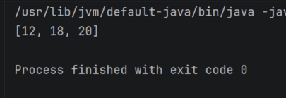

**Explicación:** Mediante la API de Streams se aplica un filtro declarativo filter(n -> n % 2 == 0 && n > 10) para
evaluar simultáneamente la paridad y que el valor supere a 10. Finalmente, se recolectan los elementos filtrados en una
lista mediante toList()


### Ejercicio 02 — Procesamiento y Transformación de Cadenas

Dada una lista de palabras, se requiere:
* Filtrar las palabras que tengan más de 4 caracteres.
* Convertirlas en Mayúsculas.
* Ordenarlas alfabéticamente.
* Obtener la cantidad total de palabras resultantes.

**Codigo Implementado**

```java
import java.util.List;

public class EjercicioPres2 {
    public static void main(String[] args) {
        List<String> words = List.of("java", "stream", "api", "functional", "code", "git"); 
        
        List<String> processedWords = words.stream()
                .filter(w -> w.length() > 4)
                .map(String::toUpperCase)
                .sorted()
                .toList();

        
        long totalCount = processedWords.size();
        
        System.out.println("Palabras resultantes: " + processedWords);
        System.out.println("Cantidad total: " + totalCount);          
    }
}
```
**Captura de ejecución:**

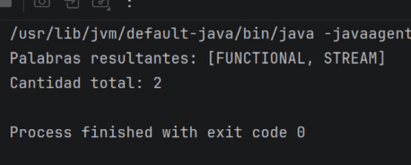

**Explicación:** Se descartan las cadenas con longitud menor o igual a 4 caracteres utilizando filter. Luego se
transforman a mayúsculas con map(String::toUpperCase), se ordenan con sorted() y se obtiene el total de palabras mediante
size()

### Ejercicio 03 - Filtrado y Ordenamiento de Usuarios Activos
Dada una lista de usuarios con los atributos id, name, age y active:
* Filtrar únicamente los usuarios activos.
* Obtener una lista con los nombres en mayúscula.
* Ordenar alfabéticamente el resultado.

**Codigo implementado**
```java
import java.util.List;

public class EjercicioPres3 {
    public static class User {
        private String id;
        private String name;
        private int age;
        private boolean active;

        public User(String id, String name, int age, boolean active) {
            this.id = id;
            this.name = name;
            this.age = age;
            this.active = active;
        }

        public String getName() { return name; }
        public int getAge() { return age; }
        public boolean isActive() { return active; }
    }

    public static void main(String[] args) {
        List<User> users = List.of(
                new User("1", "Carlos", 25, true),
                new User("2", "Ana", 22, false),
                new User("3", "Beatriz", 20, true)
        );

        
        List<String> result = users.stream()
                .filter(User::isActive)
                .map(u -> u.getName().toUpperCase())
                .sorted()
                .toList();

        System.out.println(result); 
    }
}
```
**Captura de ejecución:**

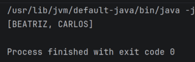

**Explicación:** La canalización de Stream filtra primero los objetos User cuya propiedad active sea true. Posteriormente,
transforma cada objeto al nombre en mayúsculas mediante map y los ordena alfabéticamente con sorted().

### Ejercicio 04 - Obtención de Nombres de Usuarios Mayores de Edad

Dado un listado de Usuarios y utilizando los mismos atributos anteriores, filtrar las personas mayores de edad (edad >= 18)
y obtener sus nombres.

**Codigo implementado**
```java
import java.util.List;

public class EjercicioPres4 {
    // Definición independiente del modelo User dentro de la clase
    public static class User {
        private String id;
        private String name;
        private int age;
        private boolean active;

        public User(String id, String name, int age, boolean active) {
            this.id = id;
            this.name = name;
            this.age = age;
            this.active = active;
        }

        public String getName() { return name; }
        public int getAge() { return age; }
        public boolean isActive() { return active; }
    }

    public static void main(String[] args) {
        List<User> users = List.of(
                new User("1", "Carlos", 25, true),
                new User("2", "Ana", 22, false),
                new User("3", "Beatriz", 20, true)
        );

        List<String> adultNames = users.stream()
                .filter(u -> u.getAge() >= 18)
                .map(User::getName)
                .toList();

        System.out.println(adultNames); 
    }
}

```
**Captura de ejecución:**

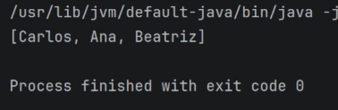

**Explicación:** Mediante filter(u -> u.getAge() >= 18) se obtienen las personas mayores de edad y con map(User::getName)
se extraen únicamente sus nombres.

### Ejercicio 05 - Validación de Lote de Transacciones Bancarias

Dada una lista de transacciones bancarias representadas por objetos Transaction, se requiere procesar la lista usando 
Streams para:
* Usar peek para ver cada transacción procesada (utilizando System.out.println).
* Verificar si existe al menos una transacción no aprobada.
* Retornar true o false indicando si el lote de transacciones es válido. 

**Codigo implementado**
```java
import java.util.List;

public class EjercicioPres5 {
    public static class Transaction {
        String id;
        double amount;
        boolean approved;

        public Transaction(String id, double amount, boolean approved) {
            this.id = id;
            this.amount = amount;
            this.approved = approved;
        }

        public boolean isApproved() { return approved; }

        @Override
        public String toString() {
            return "Transaction[id=" + id + ", amount=" + amount + ", approved=" + approved + "]";
        }
    }

    public static void main(String[] args) {
        List<Transaction> transactions = List.of(
                new Transaction("TX1", 100.0, true),
                new Transaction("TX2", 250.0, false),
                new Transaction("TX3", 50.0, true)
        );

        
        boolean isBatchValid = transactions.stream()
                .peek(t -> System.out.println("Procesando: " + t))
                .noneMatch(t -> !t.isApproved());                 

        System.out.println("¿Lote válido?: " + isBatchValid); 
    }
}
```

**Captura de ejecución:**

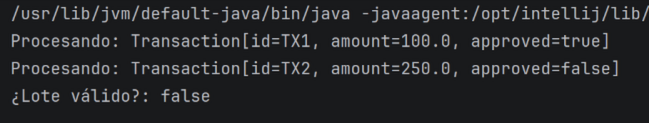

**Explicación:** La operación intermedia peek permite imprimir la información de cada transacción a medida que es evaluada.
La operación terminal noneMatch(t -> !t.isApproved()) verifica que no existan elementos desaprobados;
al encontrar TX2, termina la ejecución y retorna false, declarando inválido el lote.


# SEMANA No 2 — Bitácora Pokémon

## Datos de Entrenador

- Nombre y Apellido: Daniel Camilo Mosquera Martínez
- Código de Estudiante: 1000099251
- Curso: DOSW

---

### Ejercicio 1 — Pokémon Tipo Fuego

**Enunciado del Ejercicio**

Dada una lista de Pokémon con nombre y tipo, obtener únicamente aquellos cuyo tipo sea Fuego.

**Código implementado:** 

**Captura de ejecución:**
```java
package dosw.semana_2.pokemon;

import java.util.List;

public class Ejercicio1 {

    public static void main(String[] args) {

        List<Pokemon> pokemons = List.of(
                new Pokemon(1L,"Pikachu","Electrico",45,320,"Kanto",false),
                new Pokemon(2L,"Charmander","Fuego",62,410,"Kanto",false),
                new Pokemon(3L,"Squirtle","Agua",38,210,"Kanto",false),
                new Pokemon(4L,"Vulpix","Fuego",40,330,"Kanto",false),
                new Pokemon(5L,"Flareon","Fuego",70,520,"Kanto",false)
        );

        pokemons.stream()
                .filter(p -> p.getTipo().equalsIgnoreCase("Fuego"))
                .map(Pokemon::getNombre)
                .forEach(System.out::println);
    }
}
```

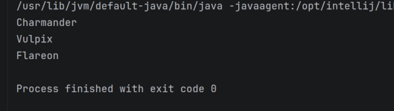

**Explicación:** Se utilizó `filter()` para seleccionar únicamente los Pokémon de tipo Fuego y `map()` para obtener sus 
nombres.

---

### Ejercicio 2 — Pokédex Gritona

**Enunciado del Ejercicio**

Transformar todos los nombres de Pokémon a mayúsculas.

**Código implementado:** 
```java
package dosw.semana_2.pokemon;

import java.util.List;

public class Ejercicio2 {

    public static void main(String[] args) {

        List<String> pokemons =
                List.of("Pikachu","Charmander","Squirtle","Bulbasaur");

        pokemons.stream()
                .map(String::toUpperCase)
                .forEach(System.out::println);
    }
}
```

**Captura de ejecución:**

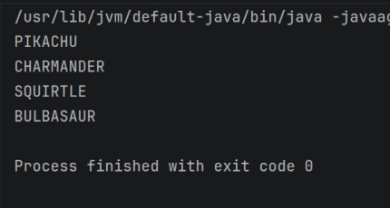

**Explicación:** Se utilizó `map()` para transformar cada nombre a mayúsculas.

---

### Ejercicio 3 — Poder Total del Equipo

**Enunciado del Ejercicio**

Calcular la suma total de niveles del equipo Pokémon.

**Código implementado:** 
```java
package dosw.semana_2.pokemon;

import java.util.List;

public class Ejercicio3 {

    public static void main(String[] args) {

        List<Integer> niveles =
                List.of(45,62,38,71,55,29);

        Integer suma =
                niveles.stream()
                        .reduce(0, Integer::sum);

        System.out.println(suma);
    }
}
```

**Captura de ejecución:**

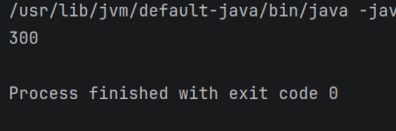

**Explicación:** Se utilizó `reduce()` para acumular la suma de todos los niveles.

---

### Ejercicio 4 — Pokémon Alfa

**Enunciado del Ejercicio**

Encontrar el Pokémon con el nivel más alto del equipo.

**Código implementado:** 
```java
package dosw.semana_2.pokemon;

import java.util.Comparator;
import java.util.List;

public class Ejercicio4 {

    public static void main(String[] args) {

        List<Pokemon> equipo = List.of(
                new Pokemon(1L,"Pikachu","Electrico",45,320,"Kanto",false),
                new Pokemon(2L,"Charmander","Fuego",62,410,"Kanto",false),
                new Pokemon(3L,"Squirtle","Agua",38,210,"Kanto",false),
                new Pokemon(4L,"Snorlax","Normal",90,600,"Kanto",false),
                new Pokemon(5L,"Mewtwo","Psiquico",88,680,"Kanto",true)
        );

        equipo.stream()
                .max(Comparator.comparingInt(Pokemon::getNivel))
                .ifPresent(System.out::println);
    }
}
```

**Captura de ejecución:**

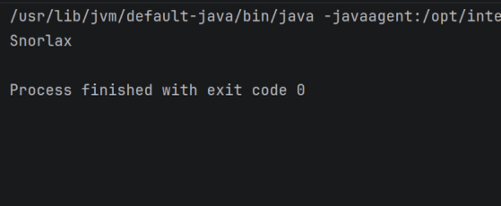

**Explicación:** Se utilizó `max()` con `Comparator` para encontrar el Pokémon de mayor nivel.

---

### Ejercicio 5 — Pokémon Legendarios

**Enunciado del Ejercicio**

Contar cuántos Pokémon tienen nivel superior a 80.

**Código implementado:** 
```java
package dosw.semana_2.pokemon;

import java.util.List;

public class Ejercicio5 {

    public static void main(String[] args) {

        List<Pokemon> equipo = List.of(
                new Pokemon(1L,"Pikachu","Electrico",45,320,"Kanto",false),
                new Pokemon(2L,"Mewtwo","Psiquico",88,680,"Kanto",true),
                new Pokemon(3L,"Dragonite","Dragon",82,530,"Kanto",false),
                new Pokemon(4L,"Mew","Psiquico",85,650,"Kanto",true),
                new Pokemon(5L,"Squirtle","Agua",38,210,"Kanto",false)
        );

        long total =
                equipo.stream()
                        .filter(p -> p.getNivel() > 80)
                        .count();

        System.out.println(total);
    }
}
```

**Captura de ejecución:**

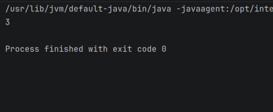

**Explicación:** Se utilizó `filter()` y `count()` para contabilizar los Pokémon que cumplen la condición.

---

### Ejercicio 6 — Pokédex Sin Duplicados

**Enunciado del Ejercicio**

Eliminar los Pokémon repetidos de una colección.

**Código implementado:** 
```java
package dosw.semana_2.pokemon;

import java.util.List;

public class Ejercicio6 {

    public static void main(String[] args) {

        List<String> pokemons = List.of(
                "Pikachu",
                "Charmander",
                "Pikachu",
                "Squirtle",
                "Charmander",
                "Mewtwo"
        );

        pokemons.stream()
                .distinct()
                .forEach(System.out::println);
    }
}
```

**Captura de ejecución:**

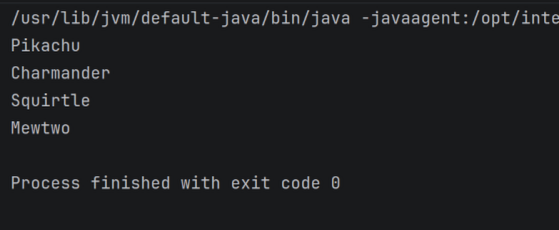

**Explicación:** Se utilizó `distinct()` para remover elementos duplicados.

---

### Ejercicio 7 — Orden del Profesor Oak

**Enunciado del Ejercicio**

Ordenar alfabéticamente los nombres de los Pokémon.

**Código implementado:** 
```java
package dosw.semana_2.pokemon;

import java.util.List;

public class Ejercicio7 {

    public static void main(String[] args) {

        List<String> pokemons = List.of(
                "Squirtle",
                "Pikachu",
                "Mewtwo",
                "Bulbasaur",
                "Charmander",
                "Abra"
        );

        pokemons.stream()
                .sorted()
                .forEach(System.out::println);
    }
}
```

**Captura de ejecución:**

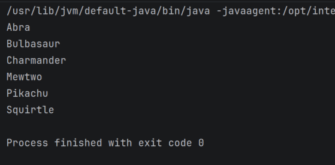

**Explicación:** Se utilizó `sorted()` para organizar los nombres en orden alfabético.

---

### Ejercicio 8 — Evoluciones Preparadas

**Enunciado del Ejercicio**

Mostrar únicamente los Pokémon que pueden evolucionar.

**Código implementado:** 
```java
package dosw.semana_2.pokemon;

import java.util.List;

public class Ejercicio8 {

    public static void main(String[] args) {

        List<PokemonEvolucion> pokemones = List.of(
                new PokemonEvolucion("Pikachu", true),
                new PokemonEvolucion("Raichu", false),
                new PokemonEvolucion("Charmander", true),
                new PokemonEvolucion("Charizard", false),
                new PokemonEvolucion("Squirtle", true),
                new PokemonEvolucion("Blastoise", false)
        );

        List<String> resultado = pokemones.stream()
                .filter(PokemonEvolucion::isPuedeEvolucionar)
                .map(PokemonEvolucion::getNombre)
                .toList();

        System.out.println(resultado);
    }
}
```

**Captura de ejecución:**

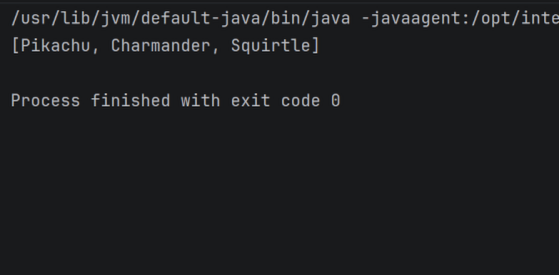

**Explicación:** Se utilizó `filter()` para seleccionar únicamente los Pokémon listos para evolucionar.

---

### Ejercicio 9 — Equipo Élite

**Enunciado del Ejercicio**

Mostrar únicamente los Pokémon cuyo poder de combate sea superior a 500.

**Código implementado:** 
```java
package dosw.semana_2.pokemon;

import java.util.List;

public class Ejercicio9 {

    public static void main(String[] args) {

        List<Pokemon> equipo = List.of(
                new Pokemon(1L,"Pikachu","Electrico",45,320,"Kanto",false),
                new Pokemon(2L,"Mewtwo","Psiquico",88,680,"Kanto",true),
                new Pokemon(3L,"Dragonite","Dragon",82,530,"Kanto",false),
                new Pokemon(4L,"Squirtle","Agua",38,210,"Kanto",false),
                new Pokemon(5L,"Gengar","Fantasma",70,495,"Kanto",false),
                new Pokemon(6L,"Charizard","Fuego",85,610,"Kanto",false)
        );

        List<Pokemon> resultado = equipo.stream()
                .filter(pokemon -> pokemon.getPoderCombate() > 500)
                .toList();

        System.out.println(resultado);
    }
}
```

**Captura de ejecución:**

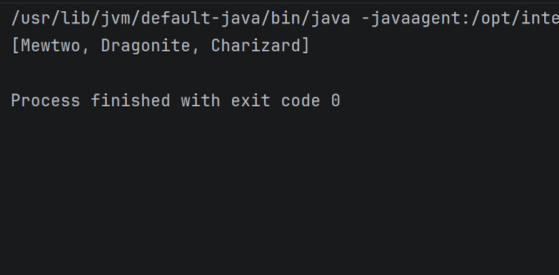

**Explicación:** Se utilizó `filter()` sobre el atributo poderCombate.

---

### Ejercicio 10 — Pokédex Compacta

**Enunciado del Ejercicio**

Generar una lista que contenga únicamente los nombres de todos los Pokémon del equipo.

**Código implementado:** 
```java
package dosw.semana_2.pokemon;

import java.util.List;
import java.util.stream.Collectors;

public class Ejercicio10 {

    public static void main(String[] args) {

        List<Pokemon> equipo = List.of(
                new Pokemon(1L,"Pikachu","Electrico",45,320,"Kanto",false),
                new Pokemon(2L,"Mewtwo","Psiquico",88,680,"Kanto",true),
                new Pokemon(3L,"Dragonite","Dragon",82,530,"Kanto",false),
                new Pokemon(4L,"Squirtle","Agua",38,210,"Kanto",false),
                new Pokemon(5L,"Gengar","Fantasma",70,495,"Kanto",false),
                new Pokemon(6L,"Charizard","Fuego",85,610,"Kanto",false)
        );

        List<String> nombres = equipo.stream()
                .map(Pokemon::getNombre)
                .collect(Collectors.toList());

        System.out.println(nombres);
    }
}
```

**Captura de ejecución:**

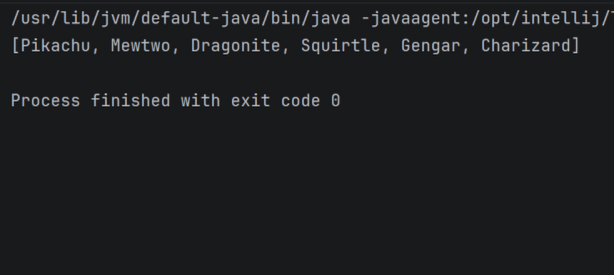

**Explicación:** Se utilizó `map()` para transformar objetos Pokémon en una lista de nombres.

---

### Ejercicio 11 — Poder Promedio

**Enunciado del Ejercicio**

Calcular el promedio de poder de combate de todos los Pokémon del equipo.

**Código implementado:** 
```java
package dosw.semana_2.pokemon;

import java.util.List;

public class Ejercicio11 {

    public static void main(String[] args) {

        List<Pokemon> pokemones = List.of(
                new Pokemon(1L,"Pikachu","Electrico",45,320,"Kanto",false),
                new Pokemon(2L,"Mewtwo","Psiquico",88,680,"Kanto",true),
                new Pokemon(3L,"Dragonite","Dragon",82,530,"Kanto",false),
                new Pokemon(4L,"Squirtle","Agua",38,210,"Kanto",false),
                new Pokemon(5L,"Gengar","Fantasma",70,495,"Kanto",false),
                new Pokemon(6L,"Charizard","Fuego",85,610,"Kanto",false)
        );

        double promedio = pokemones.stream()
                .mapToDouble(Pokemon::getPoderCombate)
                .average()
                .orElse(0);

        System.out.printf("Poder promedio: %.2f%n", promedio);
    }
}
```

**Captura de ejecución:**

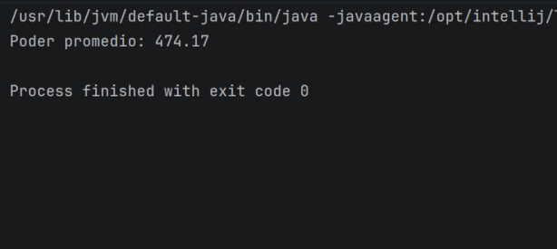

**Explicación:** Se utilizaron `mapToDouble()` y `average()` para calcular el promedio.

---

### Ejercicio 12 — Campeón Regional

**Enunciado del Ejercicio**

Obtener el Pokémon con mayor poder de combate de toda la lista.

**Código implementado:** 
```java
package dosw.semana_2.pokemon;

import java.util.Comparator;
import java.util.List;

public class Ejercicio12 {

    public static void main(String[] args) {

        List<Pokemon> pokemones = List.of(
                new Pokemon(1L,"Pikachu","Electrico",45,320,"Kanto",false),
                new Pokemon(2L,"Mewtwo","Psiquico",88,680,"Kanto",true),
                new Pokemon(3L,"Dragonite","Dragon",82,530,"Kanto",false),
                new Pokemon(4L,"Charizard","Fuego",85,610,"Kanto",false)
        );

        pokemones.stream()
                .max(Comparator.comparingDouble(Pokemon::getPoderCombate))
                .ifPresent(pokemon ->
                        System.out.println(
                                "Campeon: "
                                        + pokemon.getNombre()
                                        + " con PC: "
                                        + pokemon.getPoderCombate()));
    }
}
```

**Captura de ejecución:**

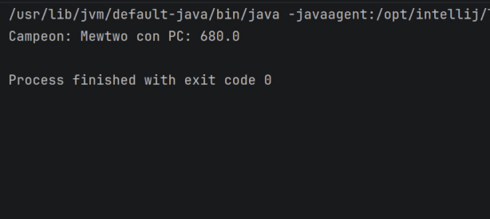

**Explicación:** Se utilizó `max()` junto con `Comparator.comparingDouble()`.

---

### Ejercicio 13 — Organizar por Tipo

**Enunciado del Ejercicio**

Agrupar todos los Pokémon por su tipo y mostrar el listado por grupo.

**Código implementado:** 
```java
package dosw.semana_2.pokemon;

import java.util.List;
import java.util.Map;
import java.util.stream.Collectors;

public class Ejercicio13 {

    public static void main(String[] args) {

        List<Pokemon> pokemones = List.of(
                new Pokemon(1L,"Squirtle","Agua",38,210,"Kanto",false),
                new Pokemon(2L,"Psyduck","Agua",40,250,"Kanto",false),
                new Pokemon(3L,"Charmander","Fuego",45,300,"Kanto",false),
                new Pokemon(4L,"Vulpix","Fuego",50,320,"Kanto",false),
                new Pokemon(5L,"Bulbasaur","Planta",42,280,"Kanto",false)
        );

        Map<String, List<String>> agrupados = pokemones.stream()
                .collect(Collectors.groupingBy(
                        Pokemon::getTipo,
                        Collectors.mapping(
                                Pokemon::getNombre,
                                Collectors.toList()
                        )
                ));

        agrupados.forEach((tipo, lista) ->
                System.out.println(tipo + ": " + lista));
    }
}
```

**Captura de ejecución:**

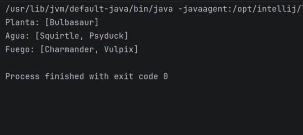

**Explicación:** Se utilizó `Collectors.groupingBy()` para agrupar por tipo.

---

### Ejercicio 14 — Organizar por Región

**Enunciado del Ejercicio**

Agrupar los Pokémon según su región de origen.

**Código implementado:** 
```java
package dosw.semana_2.pokemon;

import java.util.List;
import java.util.Map;
import java.util.stream.Collectors;

public class Ejercicio14 {

    public static void main(String[] args) {

        List<Pokemon> pokemones = List.of(
                new Pokemon(1L,"Pikachu","Electrico",45,320,"Kanto",false),
                new Pokemon(2L,"Chikorita","Planta",40,250,"Johto",false),
                new Pokemon(3L,"Torchic","Fuego",42,275,"Hoenn",false),
                new Pokemon(4L,"Piplup","Agua",38,220,"Sinnoh",false),
                new Pokemon(5L,"Charmander","Fuego",45,300,"Kanto",false),
                new Pokemon(6L,"Totodile","Agua",44,260,"Johto",false)
        );

        Map<String, List<String>> agrupados = pokemones.stream()
                .collect(Collectors.groupingBy(
                        Pokemon::getRegion,
                        Collectors.mapping(
                                Pokemon::getNombre,
                                Collectors.toList()
                        )
                ));

        agrupados.forEach((region, lista) ->
                System.out.println(region + ": " + lista));
    }
}
```

**Captura de ejecución:**

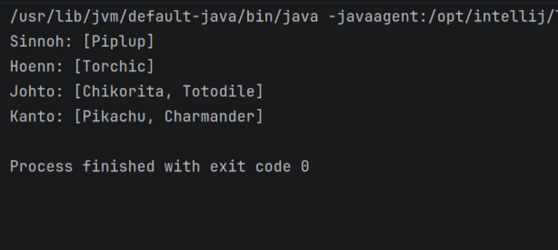

**Explicación:** Se utilizó `groupingBy()` empleando la región como criterio de agrupación.

---

### Ejercicio 15 — Maestro de Gimnasios

**Enunciado del Ejercicio**

Encontrar el entrenador con más medallas.

**Código implementado:** 
```java
package dosw.semana_2.pokemon;

import java.util.Comparator;
import java.util.List;

public class Ejercicio15 {

    public static void main(String[] args) {

        List<Entrenador> entrenadores = List.of(
                new Entrenador(1L,"Ash",8,List.of()),
                new Entrenador(2L,"Misty",5,List.of()),
                new Entrenador(3L,"Brock",6,List.of()),
                new Entrenador(4L,"Gary",10,List.of())
        );

        entrenadores.stream()
                .max(Comparator.comparingInt(Entrenador::getMedallas))
                .ifPresent(entrenador -> {
                    System.out.println(
                            "Campeón de gimnasios: "
                                    + entrenador.getNombre());

                    System.out.println(
                            "Medallas obtenidas: "
                                    + entrenador.getMedallas());
                });
    }
}
```

**Captura de ejecución:**

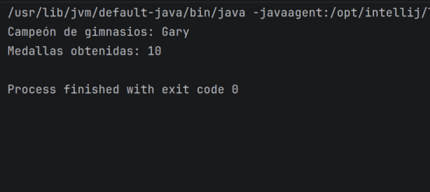

**Explicación:** Se utilizó `max()` sobre el atributo medallas.

---

### Ejercicio 16 — Entrenadores Experimentados

**Enunciado del Ejercicio**

Mostrar únicamente los entrenadores que posean más de 5 medallas.

**Código implementado:** 
```java
package dosw.semana_2.pokemon;

import java.util.List;

public class Ejercicio16 {

    public static void main(String[] args) {

        List<Entrenador> entrenadores = List.of(
                new Entrenador(1L, "Ash", 8, List.of()),
                new Entrenador(2L, "Misty", 5, List.of()),
                new Entrenador(3L, "Brock", 6, List.of()),
                new Entrenador(4L, "Gary", 10, List.of()),
                new Entrenador(5L, "May", 3, List.of()),
                new Entrenador(6L, "Dawn", 7, List.of())
        );

        List<Entrenador> resultado = entrenadores.stream()
                .filter(entrenador -> entrenador.getMedallas() > 5)
                .toList();

        System.out.println(resultado);
    }
}
```

**Captura de ejecución:**

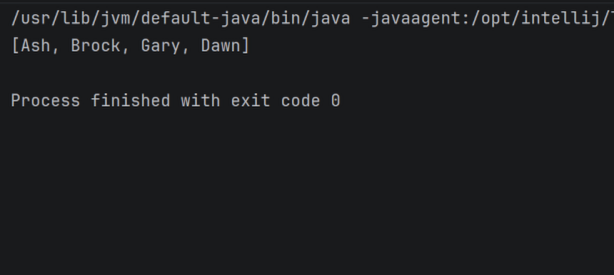

**Explicación:** Se utilizó `filter()` para seleccionar los entrenadores que cumplen la condición.

---

### Ejercicio 17 — Equipo Más Poderoso

**Enunciado del Ejercicio**

Calcular cuál entrenador tiene la suma total de poder de combate más alta entre todos sus Pokémon.

**Código implementado:** 
```java
package dosw.semana_2.pokemon;

import java.util.Comparator;
import java.util.List;

public class Ejercicio17 {

    public static void main(String[] args) {

        Entrenador ash = new Entrenador(
                1L,
                "Ash",
                8,
                List.of(
                        new Pokemon(1L,"Pikachu","Electrico",50,600,"Kanto",false),
                        new Pokemon(2L,"Charizard","Fuego",80,650,"Kanto",false),
                        new Pokemon(3L,"Snorlax","Normal",75,600,"Kanto",false)
                )
        );

        Entrenador gary = new Entrenador(
                2L,
                "Gary",
                10,
                List.of(
                        new Pokemon(4L,"Blastoise","Agua",80,800,"Kanto",false),
                        new Pokemon(5L,"Arcanine","Fuego",75,750,"Kanto",false),
                        new Pokemon(6L,"Dragonite","Dragon",85,790,"Kanto",false)
                )
        );

        Entrenador brock = new Entrenador(
                3L,
                "Brock",
                6,
                List.of(
                        new Pokemon(7L,"Onix","Roca",60,500,"Kanto",false),
                        new Pokemon(8L,"Golem","Roca",70,570,"Kanto",false),
                        new Pokemon(9L,"Steelix","Acero",80,600,"Johto",false)
                )
        );

        List<Entrenador> entrenadores =
                List.of(ash, gary, brock);

        entrenadores.stream()
                .max(Comparator.comparingDouble(
                        entrenador -> entrenador.getEquipo()
                                .stream()
                                .mapToDouble(Pokemon::getPoderCombate)
                                .sum()
                ))
                .ifPresent(entrenador -> {

                    double total = entrenador.getEquipo()
                            .stream()
                            .mapToDouble(Pokemon::getPoderCombate)
                            .sum();

                    System.out.println(
                            "Entrenador mas poderoso: "
                                    + entrenador.getNombre());

                    System.out.println(
                            "Poder acumulado: "
                                    + total);
                });
    }
}
```

**Captura de ejecución:**

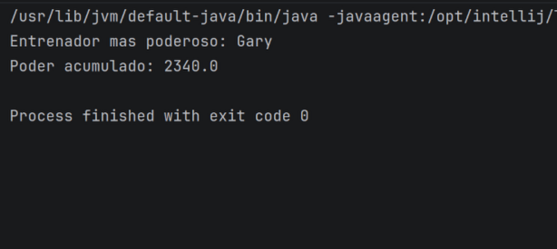

**Explicación:** Se utilizaron `mapToDouble()`, `sum()` y `max()` para identificar el equipo más poderoso.

---

### Ejercicio 18 — Top 5 Pokémon Más Fuertes

**Enunciado del Ejercicio**

Generar un ranking de los cinco Pokémon con mayor poder de combate de toda la Pokédex.

**Código implementado:** 
```java
package dosw.semana_2.pokemon;

import java.util.Comparator;
import java.util.List;
import java.util.stream.IntStream;

public class Ejercicio18 {

    public static void main(String[] args) {

        List<Pokemon> pokemones = List.of(
                new Pokemon(1L, "Pikachu", "Electrico", 45, 320, "Kanto", false),
                new Pokemon(2L, "Mewtwo", "Psiquico", 88, 680, "Kanto", true),
                new Pokemon(3L, "Dragonite", "Dragon", 82, 530, "Kanto", false),
                new Pokemon(4L, "Gengar", "Fantasma", 70, 495, "Kanto", false),
                new Pokemon(5L, "Charizard", "Fuego", 85, 610, "Kanto", false),
                new Pokemon(6L, "Blastoise", "Agua", 80, 500, "Kanto", false)
        );

        List<Pokemon> top5 = pokemones.stream()
                .sorted(
                        Comparator.comparingDouble(Pokemon::getPoderCombate)
                                .reversed()
                )
                .limit(5)
                .toList();

        IntStream.range(0, top5.size())
                .forEach(i -> System.out.println(
                        "#" + (i + 1) + " "
                                + top5.get(i).getNombre()
                                + " - PC: "
                                + top5.get(i).getPoderCombate()
                ));
    }
}
```

**Captura de ejecución:**

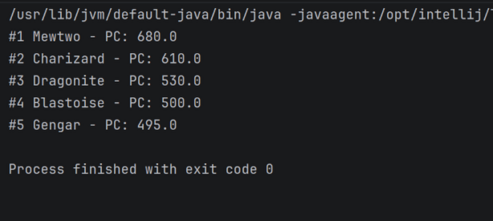

**Explicación:** Se utilizó `sorted()` en orden descendente junto con `limit(5)` para generar el ranking.

---

### Ejercicio 19 — Top 3 Entrenadores

**Enunciado del Ejercicio**

Generar un ranking de los 3 mejores entrenadores considerando medallas, poder acumulado y orden alfabético.

**Código implementado:** 
```java
package dosw.semana_2.pokemon;

import java.util.Comparator;
import java.util.List;

public class Ejercicio19 {

    public static void main(String[] args) {

        List<Entrenador> entrenadores = List.of(
                new Entrenador(1L,"Gary",10,List.of(
                        new Pokemon(1L,"Dragonite","Dragon",80,2340,"Kanto",false)
                )),
                new Entrenador(2L,"Ash",8,List.of(
                        new Pokemon(2L,"Pikachu","Electrico",75,1850,"Kanto",false)
                )),
                new Entrenador(3L,"Dawn",7,List.of(
                        new Pokemon(3L,"Empoleon","Agua",78,2100,"Sinnoh",false)
                )),
                new Entrenador(4L,"Brock",6,List.of(
                        new Pokemon(4L,"Onix","Roca",60,1670,"Kanto",false)
                ))
        );

        List<Entrenador> top3 = entrenadores.stream()
                .sorted(
                        Comparator
                                .comparingInt(Entrenador::getMedallas)
                                .reversed()
                                .thenComparing(
                                        entrenador ->
                                                entrenador.getEquipo()
                                                        .stream()
                                                        .mapToDouble(Pokemon::getPoderCombate)
                                                        .sum(),
                                        Comparator.reverseOrder()
                                )
                                .thenComparing(Entrenador::getNombre)
                )
                .limit(3)
                .toList();

        top3.forEach(entrenador -> {

            double poderTotal =
                    entrenador.getEquipo()
                            .stream()
                            .mapToDouble(Pokemon::getPoderCombate)
                            .sum();

            System.out.println(
                    entrenador.getNombre()
                            + " - Medallas: "
                            + entrenador.getMedallas()
                            + " - PC: "
                            + poderTotal);
        });
    }
}
```

**Captura de ejecución:**

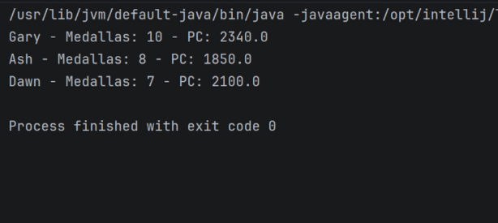

**Explicación:** Se utilizó `sorted()`, `thenComparing()` y `limit(3)` para construir el ranking.

---

### Ejercicio 20 — Pokédex Analítica

**Enunciado del Ejercicio**

Construir una estructura que muestre cantidad de Pokémon por tipo, por región, cantidad de legendarios, promedio de nivel
y el Pokémon más fuerte.

**Código implementado:** 
```java
package dosw.semana_2.pokemon;

import java.util.Comparator;
import java.util.List;
import java.util.Map;
import java.util.stream.Collectors;

public class Ejercicio20 {

    public static void main(String[] args) {

        List<Pokemon> pokemones = List.of(
                new Pokemon(1L,"Pikachu","Electrico",45,320,"Kanto",false),
                new Pokemon(2L,"Mewtwo","Psiquico",88,680,"Kanto",true),
                new Pokemon(3L,"Dragonite","Dragon",82,530,"Kanto",false),
                new Pokemon(4L,"Squirtle","Agua",38,210,"Kanto",false),
                new Pokemon(5L,"Gengar","Fantasma",70,495,"Kanto",false),
                new Pokemon(6L,"Charizard","Fuego",85,610,"Kanto",false),
                new Pokemon(7L,"Mew","Psiquico",90,670,"Kanto",true)
        );

        Map<String, Long> porTipo = pokemones.stream()
                .collect(Collectors.groupingBy(
                        Pokemon::getTipo,
                        Collectors.counting()
                ));

        Map<String, Long> porRegion = pokemones.stream()
                .collect(Collectors.groupingBy(
                        Pokemon::getRegion,
                        Collectors.counting()
                ));

        long legendarios = pokemones.stream()
                .filter(Pokemon::isLegendario)
                .count();

        double promedioNivel = pokemones.stream()
                .mapToInt(Pokemon::getNivel)
                .average()
                .orElse(0);

        Pokemon masFuerte = pokemones.stream()
                .max(Comparator.comparingDouble(
                        Pokemon::getPoderCombate))
                .orElse(null);

        System.out.println("Por tipo: " + porTipo);
        System.out.println("Por region: " + porRegion);
        System.out.println("Legendarios: " + legendarios);
        System.out.println("Promedio nivel: " + promedioNivel);

        if (masFuerte != null) {
            System.out.println(
                    "Mas fuerte: "
                            + masFuerte.getNombre()
                            + " PC: "
                            + masFuerte.getPoderCombate());
        }
    }
}
```

**Captura de ejecución:**

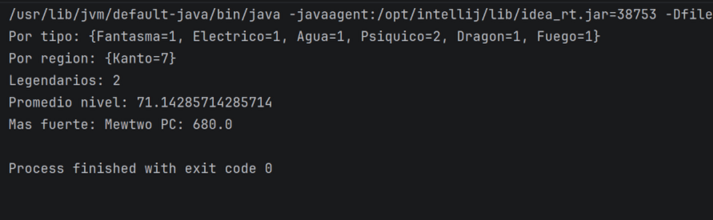

**Explicación:** Se utilizaron `groupingBy()`, `counting()`, `average()`, `filter()` y `max()` para generar estadísticas 
de la Pokédex.
